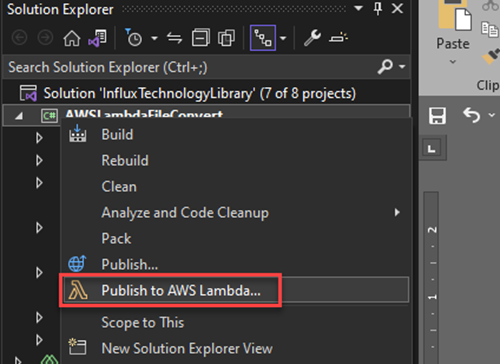

# Deploying Lambda Function to AWS

Before proceeding, make sure you have Visual Studio 2022 Installed, and the supporting components are installed as per the .vsconfig file in the link below



* Clone or download the repository.



* Open \Demo\AWS\_Lambda\AWSLambdaFileConvert.csproj.
* Provide your credentials with permission to S3 and Lambda for your AWS SDK ([Refer](https://docs.aws.amazon.com/toolkit-for-visual-studio/latest/user-guide/credentials.html))
* Right-click on the project name and select ‘Publish to AWS Lambda…’

<figure><figcaption></figcaption></figure>

*   Select

    * ‘AWS Credential’
    * Choose ‘Region’ in which you have the S3 Bucket.
    * Enter the ‘Description’ for the function if required.
    * Leave everything else to default.

    <figure><figcaption></figcaption></figure>
* Choose an IAM role that provides the Lambda functions necessary permission to access all S3 Services.

<figure><figcaption></figcaption></figure>

* Click ‘Upload’ to Upload the function to AWS.

<table data-view="cards"><thead><tr><th></th><th data-hidden data-card-target data-type="content-ref"></th></tr></thead><tbody><tr><td><mark style="color:blue;">Adding S3 Trigger for Lambda</mark></td><td><a href="https://app.gitbook.com/o/HhTfJJOHHF3lfqYUgSrl/s/c2D0aaEnAyYE7saf1pBR/~/changes/7/deploying-lambda-function-to-aws/adding-s3-trigger-for-lambda">https://app.gitbook.com/o/HhTfJJOHHF3lfqYUgSrl/s/c2D0aaEnAyYE7saf1pBR/~/changes/7/deploying-lambda-function-to-aws/adding-s3-trigger-for-lambda</a></td></tr><tr><td><mark style="color:blue;">Configuring conversion settings</mark></td><td><a href="https://app.gitbook.com/o/HhTfJJOHHF3lfqYUgSrl/s/c2D0aaEnAyYE7saf1pBR/~/changes/7/deploying-lambda-function-to-aws/configuring-conversion-settings">https://app.gitbook.com/o/HhTfJJOHHF3lfqYUgSrl/s/c2D0aaEnAyYE7saf1pBR/~/changes/7/deploying-lambda-function-to-aws/configuring-conversion-settings</a></td></tr><tr><td><mark style="color:blue;">Adding the DBC file for conversion</mark></td><td><a href="https://app.gitbook.com/o/HhTfJJOHHF3lfqYUgSrl/s/c2D0aaEnAyYE7saf1pBR/~/changes/7/deploying-lambda-function-to-aws/adding-the-dbc-file-for-conversion">https://app.gitbook.com/o/HhTfJJOHHF3lfqYUgSrl/s/c2D0aaEnAyYE7saf1pBR/~/changes/7/deploying-lambda-function-to-aws/adding-the-dbc-file-for-conversion</a></td></tr></tbody></table>
